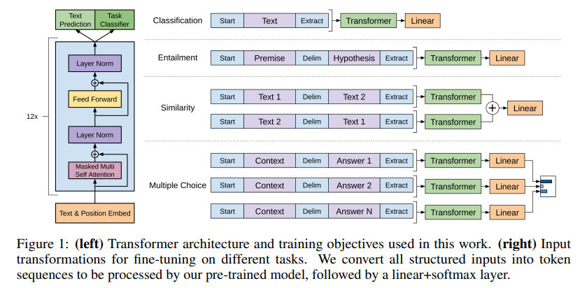

reference:
1. [Illustrated transformer by Jay Alammar](https://jalammar.github.io/illustrated-transformer/)
2. [Illustrated GPT-2 by Jay Alammar](https://jalammar.github.io/illustrated-gpt2/)
3. [Getting Started with Google BERT](https://github.com/PacktPublishing/Getting-Started-with-Google-BERT)
4. [GPT-1 설명 포스트](https://medium.com/walmartglobaltech/the-journey-of-open-ai-gpt-models-32d95b7b7fb2)

2018년 공개된 논문 [Improving language understanding by generative pre-training (Radford et al.)](https://scholar.google.com/citations?view_op=view_citation&hl=en&user=dOad5HoAAAAJ&citation_for_view=dOad5HoAAAAJ:W7OEmFMy1HYC) 에서 공개된 GPT-1 모델을 공부하는 포스트.

## transformer

GPT는 대표적인 seq-2-seq 모델인 *transformer*([Attention is all you need](https://arxiv.org/abs/1706.03762))의 decoder 만으로 구성된 구조이다. 엄밀히 말해 트랜스포머의 디코더 구조와 동일하지 않다. 트랜스포머에서는 인코더에서 만들어진 representation을 이용해 디코더의 key를 활용하여 양뱡향 attention 값을 구하는 연산하는 sublayer가 있는 반면에, GPT에서는 masked attention만 수행한다고 한다.

**주요 하이퍼 파라미터**
대체로 트랜스포머의 그것보다  더 커졌다.
* 워드 임베딩 차원 크기: 768 (트랜스포머는 512)
* 12개의 layer (트랜스포머는 6개)

## masked self-attention

### self-attention
트랜스포머의 구조와 self-attention을 이해할 때 위 레퍼런스의 도움을 많이 받았다. 특히 Getting started with google BERT책의 설명이 아주 직관적으로 이해하기가 좋다. self-attention은 말그대로 문장 하나가 인풋으로 들어왔을 때, 문장 내 토큰들이 자기 자신을 포함한 모든 토큰들과 얼마나 유사한지를 훈련하는 알고리즘이다. 이 self-attention score는 다음의 수식으로 계산된다.
<!-- $$ 
attention = Softmax(\frac{QK^T}{\sqrt {d_k}})
$$ --> 

이 때 Q(Query)와 K(Key)는 인풋 토큰(단어 임베딩+포지션 임베딩 처리가 된)에다가 임의의 훈련가능한 <!-- $W^Q, W^K$ --> 를 곱해서 만들어진다. 따라서 Q와 전치된 K의 내적을 구함으로써 각 토큰들이 자기 자신을 포함한 문장내 모든 토큰들과의 유사성을 구할 수 있다.

self-attention의 예시 (출처: Getting Started with Google BERT)

### masked self-attention
트랜스포머의 디코더와 GPT는 RNN처럼 timestep *t* 에서 출력할 단어를 예측하기 위해 *t-1*에 예측된 단어를 인풋으로 받는다. 그러나 RNN과 달리 트랜스포머 기반 모델들은 인풋을 병렬로 처리하고자 masked self-attention이라는 방법을 이용한다. 이 방식은 말그대로 *t-1* 까지의 토큰들만 참고하고 *t* 부터의 토큰들은 가리는데, 이를 위해 매 timestep마다 인풋을 새로 주지 않고 위에서 구한 attention score에서 아직 보지 못한 토큰과 관련된 점수는 <!-- $-\infty$ --> 로 처리한다. 

### BERT와 GPT의 차이

[BERT](https://arxiv.org/abs/1810.04805)(Devlin et al., 2018) 역시 transformer에서 파생한 모델이나 GPT와 달리 트랜스포머의 인코더로만 구성된 모델이다. 따라서 BERT와 GPT의 주요 차이점이라 하면 BERT는 일반적인 self-attention을 활용하는 반면에 GPT는 masked self-attention을 구한다는 점이다. Masked attention에서는 현재 timestep 이전의 아웃풋만 볼 수 있다는 점에서 단방향(uni-directional)이지만, BERT의 self-attention은 이러한 제약이 없어 양뱡향(bi-directional)으로 representation이 가능하다. 이러한 차이를 반영하여 전자를 auto-regressive 모델, 후자를 auto-encoding 모델로 구분한다.

## GPT의 훈련

Masked self-attention 외 GPT의 특이점은 pre-training과 fine-tuning을 적극적으로 활용했다는 것이다. 사실 pre-training과 fine-tuning은 요즘 워낙 흔한 훈련 방식이라 논문을 읽으면서 왜이리 강조하는지 이해가 되지 않았는데, 논문이 발표가 될 때에는 그리 흔하지 않았던 모양이다. 아무튼 논문에서 "a semi-supervised approach for language understanding tasks using a combination of unsupervised pre-training and supervised fine-tuning"이라고 명시하는 이 훈련 방식을 살펴보자면...

### pre-training
GPT의 사전훈련을 주요 핵심요소와 키워드별로 정리했다.
* training data
BooksCorpus(7000여권의 책)
* **LM**(Language Modeling) objective 
주어진 context를 기반으로 다음에 올 단어를 예측하게끔 하는 훈련
<!-- $$
L_1(U) = \sum_{i} log P(u_i | u_{i-k}, ..., u_{i-1}; \theta)\ (where \ u \in U)
$$ --> 

* **unsupervised (semi-supervised)** 
언어모델로 훈련하다 보니, 개발자들이 정답을 따로 정해줄 필요가 없어(다음 단어가 그냥 정답이다) 더 큰 데이터셋으로 훈련이 가능하다.

### fine-tuning
* **supervised**
언어모델로 사전 훈련을 한 후, 새로운 레이어를 쌓고 정답이 있는 세부 과제로 추가 훈련을 한다. 사전 훈련과 달리 약간의 훈련만으로도 고성능을 낼 수 있다.

* 추가 훈련되는 파라미터
과제에 따라 맨 마지막에 linear layer (+ softmax)층을 새로 추가하는데, 이 층의 웨이트들을 파인 튜닝시 추가로 업데이트 된다. 
뿐만 아니라 과제 성격에 맞게 인풋 데이터가 변형되는 경우가 있다. 예를 들어 아래 그림에서 보듯 text 쌍이 필요한 과제의 경우, [Delim]이라는 delimiter 토큰이 추가되는 경우가 있는데, 이 [Delim] 토큰의 임베딩도 역시 훈련 대상이다. 

